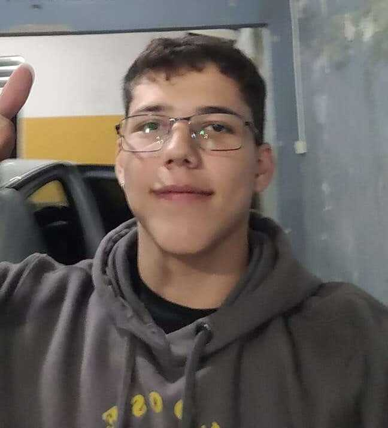

## _`$ whoami`_

**Name:** Diogo Braz (a.k.a. norrköping)

**Profession:** Junior Backend Software Engineer

**Location:** Santos - São Paulo

---

**Twitter:** <ins>[@diogo_korpe](https://twitter.com/diogo_korpe)</ins>

**Github:** <ins>[diogo-braz](https://github.com/diogo-braz)</ins>

**LinkedIn:** <ins>[Diogo Braz](https://www.linkedin.com/in/diogo-braz/)</ins>

 

## _`$ cat about_me.txt`_

I am currently studying computer science, I work in the development area but I want to migrate to the security area. I like to study reverse engineering, algorithm analysis and cryptography. In my spare time, I like to go to the gym, play basketball, and especially ride my motorcycle. Besides this, I like to listen mainly to rock and rap music.